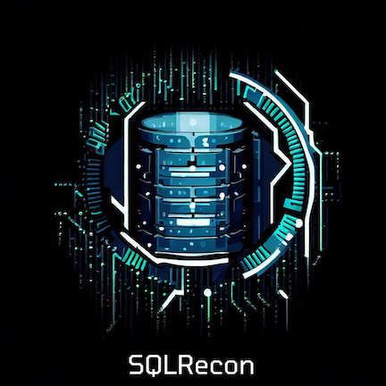

 &nbsp;
[![licence badge]][licence] 
[![wiki Badge]][wiki] 
[![stars badge]][stars] 
[![forks badge]][forks] 
[![issues badge]][issues] 

[licence badge]:https://img.shields.io/badge/License-BSD_3--Clause-blue.svg
[stars badge]:https://img.shields.io/github/stars/skahwah/SQLRecon.svg
[forks badge]:https://img.shields.io/github/forks/skahwah/SQLRecon.svg
[issues badge]:https://img.shields.io/github/issues/skahwah/SQLRecon.svg
[wiki badge]:https://img.shields.io/badge/SQLRecon-Wiki-green.svg

[licence]:https://github.com/skahwah/SQLRecon/blob/main/LICENSE
[stars]:https://github.com/skahwah/SQLRecon/stargazers
[forks]:https://github.com/skahwah/SQLRecon/network
[issues]:https://github.com/skahwah/SQLRecon/issues
[wiki]:https://github.com/skahwah/SQLRecon/wiki

# SQLRecon

<p align="center">
  
</p>

SQLRecon is a Microsoft SQL Server toolkit that is designed for offensive reconnaissance and post-exploitation. For detailed information on how to use each technique, refer to the <a href="https://github.com/skahwah/SQLRecon/wiki">wiki</a>. 

<a href="https://github.com/skahwah/SQLRecon/wiki/8.-Prevention,-Detection-and-Mitigation-Guidance">Prevention, detection and mitigation guidance</a> has also been provided for all you defenders out there.

Check out my blog post on the <a href="https://securityintelligence.com/posts/databases-beware-abusing-microsoft-sql-server-with-sqlrecon/">IBM Security Intelligence</a> website.

# Overview

You can download a copy of SQLRecon from the [releases](https://github.com/skahwah/SQLRecon/releases) page. Alternatively, feel free to compile the solution yourself. This should be as straight forward as cloning the repo, double clicking the solution file and building.

## Enumeration

SQLRecon supports enumerating Active Directory for Server Principal Names (SPNs) that are associated with Microsoft SQL Server.

Enumeration Modules (`/e:, /enum:`) do not require an authentication provider to be supplied.

```
SqlSpns - Use the current user token to enumerate the current AD domain for MSSQL SPNs
        /d:, /domain: | (OPTIONAL) NETBIOS name (DOMAIN) or FQDN of domain (DOMAIN.COM)
```

## Authentication Providers

SQLRecon supports a diverse set of authentication providers to enable interacting with a Microsoft SQL Server. An authentication provider must be supplied (`/a:, /auth:`).


```
WinToken - Use the current users token to authenticate against the SQL database
        /h:, /host: | SQL server hostname or IP
        /database:  | (OPTIONAL) SQL server database name, defaults to 'master'
        /port:      | (OPTIONAL) Defaults to 1433

WinDomain - Use AD credentials to authenticate against the SQL database
        /h:, /host:     | SQL server hostname or IP
        /d:, /domain:   | NETBIOS name (DOMAIN) or FQDN of domain (DOMAIN.COM)
        /u:, /username: | Username for domain user
        /p:, /password: | Password for domain user
        /database:      | (OPTIONAL) SQL server database name, defaults to 'master'
        /port:          | (OPTIONAL) Defaults to 1433

Local - Use local SQL credentials to authenticate against the SQL database
        /h:, /host:     | SQL server hostname or IP
        /u:, /username: | Username for local SQL user
        /p:, /password: | Password for local SQL user
        /database:      | (OPTIONAL) SQL server database name, defaults to 'master'
        /port:          | (OPTIONAL) Defaults to 1433

AzureAD - Use Azure AD credentials to authenticate against the Azure SQL database
        /h:, /host:     | SQL server hostname or IP
        /d:, /domain:   | FQDN of domain (DOMAIN.COM)
        /u:, /username: | Username for domain user
        /p:, /password: | Password for domain user
        /database:      | (OPTIONAL) SQL server database name, defaults to 'master'

AzureLocal - Use local SQL credentials to authenticate against the Azure SQL database
        /h:, /host:     | SQL server hostname or IP
        /u:, /username: | Username for local SQL user
        /p:, /password: | Password for local SQL user
        /database:      | (OPTIONAL) SQL server database name, defaults to 'master'
        /port:          | (OPTIONAL) Defaults to 1433
```

There are cases where a Microsoft SQL Server might not be listening on a standard TCP port. Some examples are Microsoft SQL Server failover clustering, or dynamic TCP ports. SQLRecon supports setting non-standard connection port by supplying the port flag (`/port:`). By default, SQLRecon will connect to databases via TCP Port 1433.

SQLRecon connects to the `master` database by default, however, this can be changed by supplying a custom database name via the database flag (`/database:`).

Please note that the `AzureAD` authentication provider reqires that the Azure Active Directory Authentication Library (ADAL) or Microsoft Authentication Library (MSAL) exists on the system SQLRecon is executed from. This is for Azure Active Directory authentication and authorization functionality.

## Standard Modules

Standard modules are executed against a single instance of Microsoft SQL server. Standard modules must be passed into the module flag (`/m:, /module:`).

Modules starting with `[*]` require the sysadmin role or a similar privileged context.

For detailed information on how to use each technique, refer to the <a href="https://github.com/skahwah/SQLRecon/wiki/3.-Standard-Modules">wiki</a>. 

```
Info                                                     | Show information about the SQL server
Query /c:QUERY                                           | Execute a SQL query
Whoami                                                   | Display what user you are logged in as, mapped as and what roles exist
Users                                                    | Display what user accounts and groups can authenticate against the database
Databases                                                | Display all databases
Tables /db:DATABASE                                      | Display all tables in the supplied database
Columns /db:DATABASE /table:TABLE                        | Display all columns in the supplied database and table
Rows /db:DATABASE /table:TABLE                           | Display the number of rows in the supplied database table
Search /keyword:KEYWORD                                  | Search column names in the supplied table of the database you are connected to
Smb /rhost:UNC_PATH                                      | Capture NetNTLMv2 hash
Impersonate                                              | Enumerate user accounts that can be impersonated
Links                                                    | Enumerate linked SQL servers
CheckRpc                                                 | Obtain a list of linked servers and their RPC status
[*] EnableRpc /rhost:LINKED_HOST                         | Enable RPC and RPC out on a linked server
[*] DisableRpc /rhost:LINKED_HOST                        | Disable RPC and RPC out on a linked server
[*] EnableXp                                             | Enable xp_cmdshell
[*] DisableXp                                            | Disable xp_cmdshell
[*] XpCmd /c:COMMAND                                     | Execute a system command using xp_cmdshell
[*] EnableOle                                            | Enable OLE automation procedures
[*] DisableOle                                           | Disable OLE automation procedures
[*] OleCmd /c:COMMAND                                    | Execute a system command using OLE automation procedures
[*] EnableClr                                            | Enable CLR integration
[*] DisableClr                                           | Disable CLR integration
[*] Clr /dll:DLL /function:FUNCTION                      | Load and execute a .NET assembly in a custom stored procedure
[*] AgentStatus                                          | Display if SQL agent is running and obtain agent jobs
[*] AgentCmd /c:COMMAND                                  | Execute a system command using agent jobs
[*] Adsi /rhost:ADSI_SERVER_NAME /lport:LDAP_SERVER_PORT | Obtain cleartext ADSI credentials from a linked ADSI server
```

## Linked Modules

Linked modules are executed on a linked Microsoft SQL server. 

All linked modules have the following minimum requirements:
- A linked SQL server must be specified (`/l:, /lhost:`).
- A linked module must be specified (`/m:, /module:`). 

Modules starting with `[*]` require the sysadmin role or a similar privileged context.

For detailed information on how to use each technique, refer to the <a href="https://github.com/skahwah/SQLRecon/wiki/4.-Linked-Modules">wiki</a>. 

```
lQuery /l:LINKED_HOST /c:QUERY                                           | Execute a SQL query
lWhoami /l:LINKED_HOST                                                   | Display what user you are logged in as, mapped as and what roles exist
lUsers /l:LINKED_HOST                                                    | Display what user accounts and groups can authenticate against the database
lDatabases /l:LINKED_HOST                                                | Display all databases
lTables /l:LINKED_HOST /db:DATABASE                                      | Display all tables in the supplied database
lColumns /l:LINKED_HOST /db:DATABASE /table:TABLE                        | Display all columns in the supplied database and table
lRows /l:LINKED_HOST /db:DATABASE /table:TABLE                           | Display the number of rows in the supplied database and table
lSearch /l:LINKED_HOST /db:DATABASE /keyword:KEYWORD                     | Search column names in the supplied table of the database you are connected to
lSmb /l:LINKED_HOST /rhost:UNC_PATH                                      | Capture NetNTLMv2 hash
lLinks /l:LINKED_HOST                                                    | Enumerate linked SQL servers on a linked SQL server
lCheckRpc /l:LINKED_HOST                                                 | Obtain a list of linked servers on the linked server and their RPC status
[*] lEnableXp /l:LINKED_HOST                                             | Enable xp_cmdshell
[*] lDisableXp /l:LINKED_HOST                                            | Disable xp_cmdshell
[*] lXpCmd /l:LINKED_HOST /c:COMMAND                                     | Execute a system command using xp_cmdshell
[*] lEnableOle /l:LINKED_HOST                                            | Enable OLE automation procedures
[*] lDisableOle /l:LINKED_HOST                                           | Disable OLE automation procedures
[*] lOleCmd /l:LINKED_HOST /c:COMMAND                                    | Execute a system command using OLE automation procedures
[*] lEnableClr /l:LINKED_HOST                                            | Enable CLR integration
[*] lDisableClr /l:LINKED_HOST                                           | Disable CLR integration
[*] lClr /l:LINKED_HOST /dll:DLL /function:FUNCTION                      | Load and execute a .NET assembly in a custom stored procedure
[*] lAgentStatus /l:LINKED_HOST                                          | Display if SQL agent is running and obtain agent jobs
[*] lAgentCmd /l:LINKED_HOST /c:COMMAND                                  | Execute a system command using agent jobs
[*] lAdsi /l:LINKED_HOST /rhost:ADSI_SERVER_NAME /lport:LDAP_SERVER_PORT | Obtain cleartext ADSI credentials from a double-linked ADSI server
```

## Impersonation Modules

Impersonation modules are executed against a single instance of Microsoft SQL server, under the context of an impersonated SQL user.

All impersonation modules have the following minimum requirements:
- An impersonation user must be specified (`/i:, /iuser:`).
- An impersonation module must be specified (`/m:, /module:`).

Modules starting with `[*]` require the sysadmin role or a similar privileged context.

For detailed information on how to use each technique, refer to the <a href="https://github.com/skahwah/SQLRecon/wiki/5.-Impersonation-Modules">wiki</a>. 

```
iQuery /i:IMPERSONATE_USER /c:QUERY                                           | Execute a SQL query
iWhoami /i:IMPERSONATE_USER                                                   | Display what user you are logged in as, mapped as and what roles exist
iUsers /i:IMPERSONATE_USER                                                    | Display what user accounts and groups can authenticate against the database
iDatabases /i:IMPERSONATE_USER                                                | Display all databases
iTables /i:IMPERSONATE_USER /db:DATABASE                                      | Display all tables in the supplied database
iColumns /i:IMPERSONATE_USER /db:DATABASE /table:TABLE                        | Show all columns in the database and table you specify
iRows /i:IMPERSONATE_USER /db:DATABASE /table:TABLE                           | Display the number of rows in the database and table you specify
iSearch /i:IMPERSONATE_USER /keyword:KEYWORD                                  | Search column names in the supplied table of the database you are connected to
iLinks /i:IMPERSONATE_USER                                                    | Enumerate linked SQL servers
iCheckRpc /i:IMPERSONATE_USER                                                 | Obtain a list of linked servers and their RPC status
[*] iEnableRpc /i:IMPERSONATE_USER /rhost:LINKED_HOST                         | Enable RPC and RPC out on a linked server
[*] iDisableRpc /i:IMPERSONATE_USER /rhost:LINKED_HOST                        | Disable RPC and RPC out on a linked server
[*] iEnableXp /i:IMPERSONATE_USER                                             | Enable xp_cmdshell
[*] iDisableXp /i:IMPERSONATE_USER                                            | Disable xp_cmdshell
[*] iXpCmd /i:IMPERSONATE_USER /c:COMMAND                                     | Execute a system command using xp_cmdshell
[*] iEnableOle /i:IMPERSONATE_USER                                            | Enable OLE automation procedures
[*] iDisableOle /i:IMPERSONATE_USER                                           | Disable OLE automation procedures
[*] iOleCmd /i:IMPERSONATE_USER /c:COMMAND                                    | Execute a system command using OLE automation procedures
[*] iEnableClr /i:IMPERSONATE_USER                                            | Enable CLR integration
[*] iDisableClr /i:IMPERSONATE_USER                                           | Disable CLR integration
[*] iClr /i:IMPERSONATE_USER /dll:DLL /function:FUNCTION                      | Load and execute a .NET assembly in a custom stored procedure
[*] iAgentStatus /i:IMPERSONATE_USER                                          | Display if SQL agent is running and obtain agent jobs
[*] iAgentCmd /i:IMPERSONATE_USER /c:COMMAND                                  | Execute a system command using agent jobs
[*] iAdsi /i:IMPERSONATE_USER /rhost:ADSI_SERVER_NAME /lport:LDAP_SERVER_PORT | Obtain cleartext ADSI credentials from a linked ADSI server
```

## SCCM Modules

SQLRecon has several modules that can assist with enumerating and attacking Microsoft System Center Configuration Manager (SCCM) and Microsoft Endpoint Configuration Manager (ECM). 

SCCM modules must be passed into the module flag (`/m:, /module:`).

SCCM and ECM will need to have a Microsoft SQL database exposed either locally or remotely.

Modules starting with `[*]` require the sysadmin role or a similar privileged context.

For detailed information on how to use each technique, refer to the <a href="https://github.com/skahwah/SQLRecon/wiki/6.-SCCM-Modules">wiki</a>. 

```
sUsers                                                | Display all SCCM users
sSites                                                | Display all other sites with data stored
sLogons /option:OPTIONAL_FILTER                       | Display all associated SCCM clients and the last logged in user
sTaskList                                             | Display all task sequences, but do not access the task data contents
sTaskData                                             | Decrypt all task sequences to plaintext
sCredentials                                          | Display encrypted credentials vaulted by SCCM
[*] sDecryptCredentials                               | Attempt to decrypt recovered SCCM credential blobs. Must be ran in a high-integrty or SYSTEM process on an SCCM server
[*] sAddAdmin /user:DOMAIN\USERNAME /sid:SID          | This will elevate a supplied account to a 'Full Administrator' in SCCM
[*] sRemoveAdmin /user:ADMIN_ID /remove:REMOVE_STRING | Removes privileges of a user, or remove a user entirely from the SCCM database
```

The table below contains additional information for each SCCM module:

| Module | Description |
| ------ | ----------- |
| sUsers | Lists all users in the `RBAC_Admins` table. These are all users configured for some level of access to SCCM. |
| sSites | Lists all other sites with data stored in the SCCM databases' `DPInfo` table. This can provide additional attack avenues as different sites can be configured in different (insecure) ways. |
| sLogons | Queries the `Computer_System_DATA` table to retrieve all associated SCCM clients along with the user that last logged into them. <b>NOTE:</b> This only updates once a week by default and will not be 100% up to date. Use `/option:` as an optional (not required) argument to filter SCCM clients. |
| sTaskList | Provides a list of all task sequences stored in the SCCM database, but does not access the actual task data contents. |
| sTaskData | Recovers all task sequences stored in the SCCM database and decrypts them to plaintext. Task sequences can contain credentials for joining systems to domains, mapping shares, running commands, etc. |
| sCredentials | Lists credentials vaulted by SCCM for use in various functions. These credentials can not be remotely decrypted as the key is stored on the SCCM server. However, this module provides intel on if it makes sense to attempt to obtain the key. |
| sDecryptCredentials | Attempt to decrypt recovered SCCM credential blobs. This module must be ran in a high-integrty or SYSTEM process on an SCCM server. |
| sAddAdmin | This module will elevate the specified account to a 'Full Administrator' within SCCM. If target user is already an SCCM user, this module will instead add necessary privileges to elevate. Provide two arguments, either `/user:current /sid:current` if seeking to add the user currently executing the SQLRecon process as a 'Full Administrator' in SCCM. If seeking to add another user as a 'Full Administrator' in SCCM, specify their domain user name and full SID `/user:DOMAIN\USERNAME /sid:S-1-5-...`.  This module require sysadmin or similar privileges as writing to SCCM database tables is required. |
| sRemoveAdmin | This modlue removes the privileges of a user by removing a newly added user entirely from the SCCM database. If the user already existed in some capacity this module just removes the three roles that were added to the account via writes to the permission table. Use the arguments provided by output of the `sAddAdmin` command to run this command. This module require sysadmin or similar privileges as writing to SCCM database tables is required. |

## Extending SQLRecon

If you are interested in extending SQLRecon, refer to the write up in the <a href="https://github.com/skahwah/SQLRecon/wiki/7.-Contributing-and-Extending-SQLRecon">wiki</a>.

## History

<details>
<summary>v3.3</summary>

* Created `rows`, `iRows` and `lRows` modules.
* Updated `sLogons` to include an optional filter.
* Bug fix where `xp_cmdshell` modules were not printing command output to console.
* Cleaned up Help menu.
</details>

<details>
<summary>v3.2</summary>

* Command line argument parsing overhaul.
* Updated README, test cases and wiki with new examples.
* Reworked enumeration and authentication based argument parsing.
* Created `SetEnumerationType.cs`.
* Changed enumeration module `domain` to `SqlSpns`.
</details>

<details>
<summary>v3.1</summary>

* Changed `SetAuthenticationType.cs` constructor to a new method called `EvaluateAuthenticationType`.
* Created `CreateSqlConnectionObject` in `SetAuthenticationType.cs` which extends SQLRecon to support multiple simultaneous SQL connection objects.
* Created `ADSI.cs`, which incorporates ADSI credential attacks as described [here](https://www.tarlogic.com/blog/linked-servers-adsi-passwords/).
* Created `adsi`, `iAdsi`, and `lAdsi` modules.
* Created `lLinks` and `iLinks` modules.
* Updated README, test cases and wiki with new examples.
</details>

<details>
<summary>v3.0</summary>

* Implemented error checking for non-existant impersonated users.
* Created `ExecuteImpersonationQuery` and `ExecuteImpersonationCustomQuery`.
* Deleted `Impersonate.cs`
* Added `checkRpc` module.
* Added `iCheckRpc` module.
* Added `lCheckRpc` module.
* Reworked SCCM modules.
* Reworked SCCM argument parsing.
* Camel cased commands in help menu for easier reading.
* Updated tests with new modules.
</details>

<details>
<summary>v2.9</summary>

* Renamed `EnableDisable.cs` to `ConfigureOptions.cs`
* Overhauled advanced option configurations.
* Implemented RPC error checking wherever `ExecuteLinkedCustomQueryRpcExec` is called.
</details>

<details>
<summary>v2.8</summary>

* Created` PrintUtils.cs`, which implements a print class for standardized output.
* Moved `TablePrinter` from `Help.cs` to `PrintUtils.cs`.
* Standardized print formatting for all console output using the `PrintUtils` class.
* Changed access modifiers for classes and class variables.
* Added check to see if result is empty for: 
    * `query`
    * `search`
    * `tables`
    * `lColumns`
    * `lQuery`
    * `lSearch`
    * `lTables`
    * `iColumns`
    * `iQuery`
    * `iSearch`
* Signifiant reliability and functionality testing against all authentication providers and modules.
</details>

<details>
<summary>v2.7</summary>

* Changed `Azure` authentication to `AzureAD`.
* Created `AzureLocal` authentication.
* Added `disableRpc` module.
* Added `enableRpc` module.
* Added `iEnableRpc` module.
* Added `iDisableRpc` module.
* Removed `lEnableRpc` module.
* Removed `lDisbleRpc` module.
* Updated tests with new modules.
</details>

<details>
<summary>v2.6.1</summary>

* `lAgentCmd` bug fixes.
* Fixed `clr`, `iClr` and `lClr` stability by using `SqlCommand.ExecuteNonQuery` when creating the stored procedure.
* Fixed `lClr` bug where it was not removing created assemblies or stored procedures.
</details>

<details>
<summary>v2.6</summary>

* Added `columns` module.
* Added `iColumns` module.
* Added `iDatabases` module.
* Added `iSearch` module.
* Added `iTables` module.
* Added `lColumns` module.
* Added `lSearch` module.
</details>

<details>
<summary>v2.5</summary>

* Various bug fixed in the SCCM modules.
* Organized the help menu using a table.
* Improved the output provided by `ExecuteLinkedCustomQueryRpcExec`.
* Improved code commenting through out.
* Improved consistency of method names across command execution functions.
* Improved modularity through better use of object oriented programming.
* Changed custom SQL server port flag to `x`.
* Moved `Random.cs` into `utilities` directory.
* Standardized the printing style to make it more consistent across all modules.
* Created standard, impersonation and linked test harnesses.
</details>

<details>
<summary>v2.4</summary>

* Changed `Windows` authentication to `WinToken`.
* Created `WinDomain` authentication, which uses AD domain username and password for authentication via impersonation. Check out `Impersonation.cs`.
* Reworked argument parsing and handling across `ArgumentLogic.cs`,` SQLAuthentication.cs` and `ModuleHandler.cs`.
* `ModuleHandler.cs` no longer uses a massive if/else if/else statement to execute modules. Instead, reflection is now used to call methods matching command modules names.
* Added `commands` directory, which has global variables that are used throughout the program.
* Rolled all authentication providers into `SQLAuthentication.cs`.
* Moved argument parsing from `Program.cs` to `ArgumentLogic.cs`.
* Removed the `authentication` directory.
* Changed code style to better follow [Microsoft's C#/.NET style code style guide](https://learn.microsoft.com/en-us/dotnet/csharp/fundamentals/coding-style/coding-conventions).
* Changed `Help.cs` from a method into a constructor.
* Changed `CaptureHash.cs` from a method into a constructor.
* Changed `Impersonate.cs` from a method into a constructor.
* Re-factored complete code base.
</details>

<details>
<summary>v2.3</summary>

* Added SCCM functionality.
* Added SCCM modules, which can be executed using the `sccm` command.
* Fixed checking RPC status on linked SQL servers.
* Added the capability to download .NET assemblies via HTTP/S.
</details>

<details>
<summary>v2.2</summary>

* Expanded roles which are queried in the `roles`, `iRoles` and `lRoles` modules.
* Created `users`, `iUsers` and `lUsers` modules.
* Fixed hash not being dropped from `sp_drop_trusted_assembly` in `clr` and `iClr` modules.
* Created `lAgentCmd` module.
* Created `lClr` module.
</details>

<details>
<summary>v2.1.6</summary>

* Added `info` module.
* Corrections in help menu.
* Resolved issues with mandatory arguments with `Local` and `Azure` authentication.
</details>

<details>
<summary>v2.1.5</summary>

* Added module to enumerate domain SPNs (`-e domain`).
</details>

<details>
<summary>v2.1.4</summary>

* Fixed minor string formatting issue.
</details>

<details>
<summary>v2.1.3</summary>

* Added `-r` flag into `Windows` and `Local` authentication modes so that non-standard TCP ports can be supplied.
</details>

<details>
<summary>v2.1.2</summary>

* Improved logic around null connection strings.
</details>

<details>
<summary>v2.1.1</summary>

* Removed `Environment.Exit` from `TestAuthentication.cs`.
</details>

<details>
<summary>v2.1</summary>

* Created `AgentJobs.cs`.
* Created `agentStatus`.
* Created `iAgentStatus`.
* Created `lAgentStatus`.
* Created `agentCmd`.
* Created `iAgentCmd`.
</details>

<details>
<summary>v2.0</summary>

* Created `clr`.
* Created `iEnableClr`.
* Created `iDisbleClr`.
* Created `iClr`.
* Created `iWhoami`.
* Created `iMapped`.
* Created `iRoles`.
* Created `lEnableRpc`.
* Created `lDisableRpc`.
* Created `lWhoai`.
* Created `lEnableXp`.
* Created `lDisableXp`.
* Created `lEnableOle`.
* Created `lDisableOle`.
* Created `lEnableClr`.
* Created `lDisableClr`.
* Created `lXpCmd`.
* Created `lXpOle`.
* Created `Random.cs`.
* Created `EnableDisable.cs`.
* Implemented randomly generated assembly names for `clr`.
* Implemented randomly generated variable and method names for `ole`.
* Rolled `mapped` and `roles` modules into `whoami`.
* Rolled `lMapped` and `lRoles` modules into `lWhoami`.
* Rolled `iMapped` and `iRoles` modules into `iWhoami`.
* Re-factored complete code base.
</details>

<details>
<summary>v1.2</summary>

* Created `lSmb` module.
* Created `lWhoami` module.
* Created `lRoles` module.
</details>

<details>
<summary>v1.1</summary>

* Fixed `oldCmd` module.
* Fixed `iOleCmd` module.
* Fixed `lDatabases` module.
* Fixed `lTables` module.
* Cleaned up code base.
* Corrected inconsistencies in help menu.
</details>
